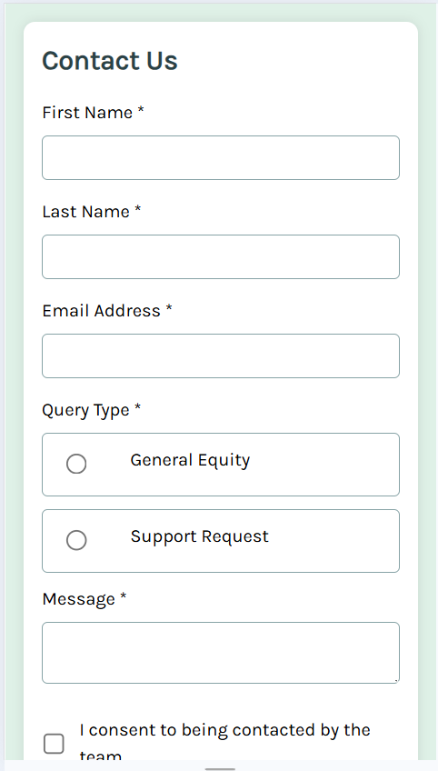
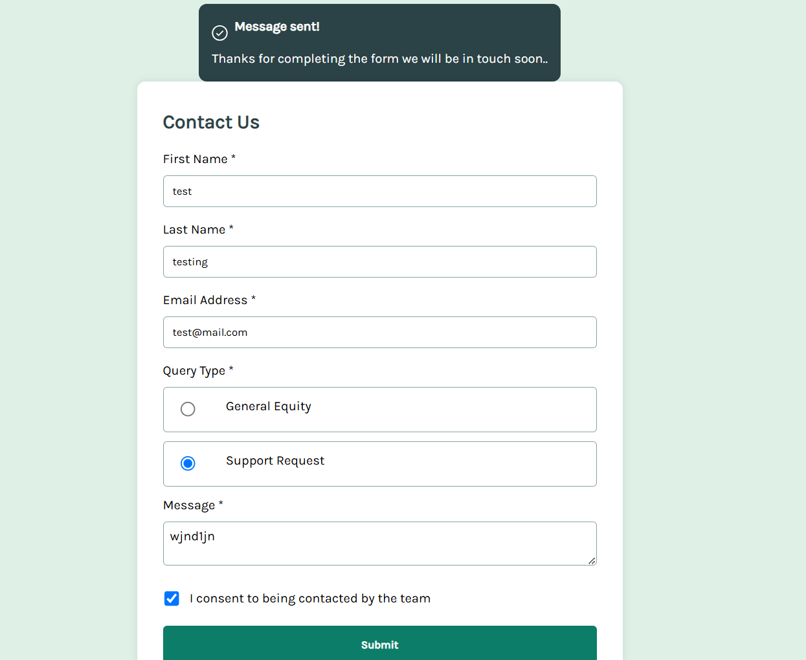

# Contact Form 

## Table of contents

-[Overview](#overview)

-[Challange](#challenge)

-[Screenshots](#screenshot)

-[Built with](#built-with)

- [My process](#my-process)

- [Built with](#built-with)

## Overview

### The challenge

Users should be able to:

- Complete the form and see a success toast message upon successful submission
- Receive form validation messages if:
  - A required field has been missed
  - The email address is not formatted correctly
- Complete the form only using their keyboard
- Have inputs, error messages, and the success message announced on their screen reader
- View the optimal layout for the interface depending on their device's screen size
- See hover and focus states for all interactive elements on the page

### Screenshots

## My process

### Built with

- Semantic HTML5 markup
- CSS custom properties
- Flexbox
- Mobile-first workflow
- DOM manipulation JavaScript

